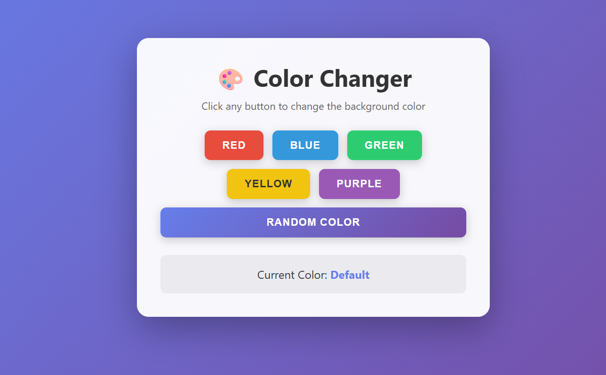
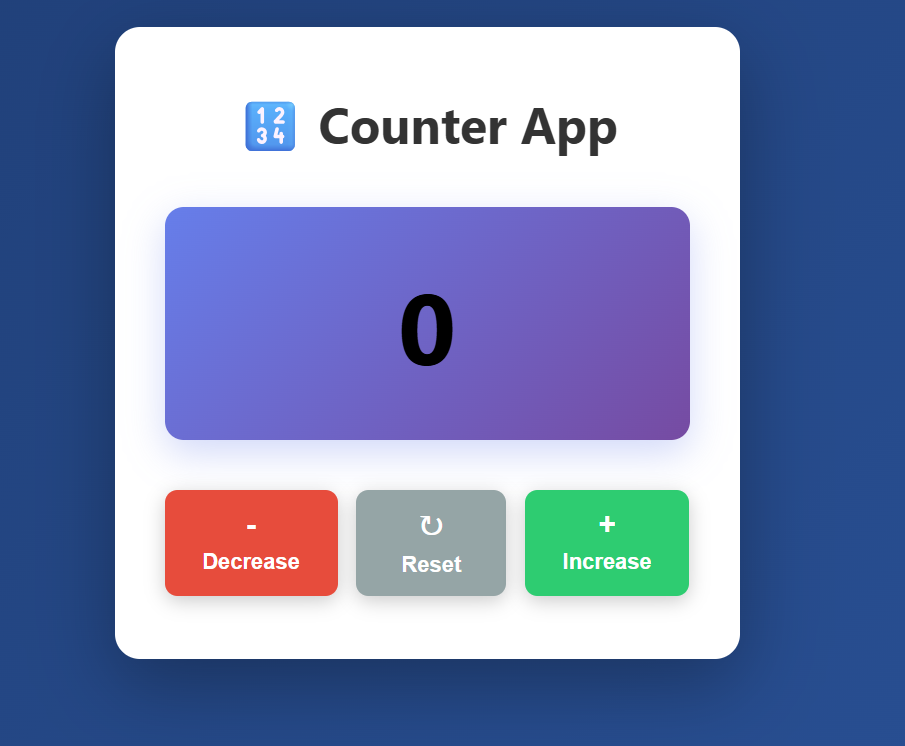
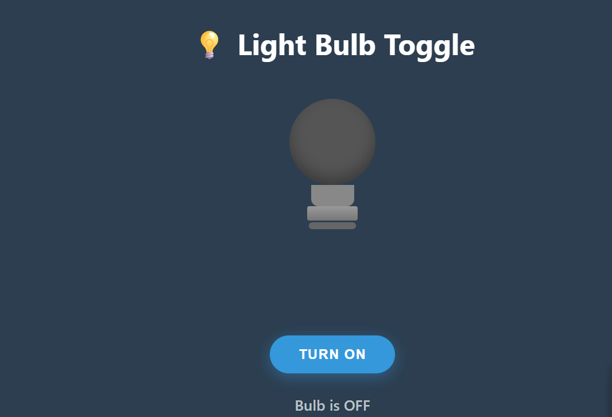
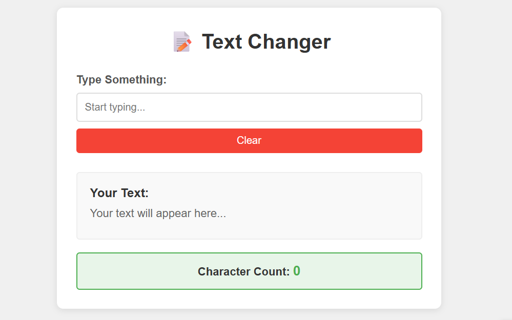

# JavaScript Practice Projects

Small JavaScript practice projects focused on DOM manipulation, events, and core JavaScript fundamentals.  
These projects are built to strengthen logic, improve hands-on skills, and develop confidence in writing clean JavaScript code.

---

## 📁 Projects Included

### 1️⃣ Color Change
A simple project where the background color changes on user interaction.

**Concepts used:**
- DOM selection
- Event handling
- Style manipulation

---

### 2️⃣ Counter App
A counter application with increase, decrease, and reset functionality.

**Concepts used:**
- Variables and state
- Click events
- Conditional logic

---

### 3️⃣ Light Bulb Toggle
A toggle-based project that switches a light bulb on and off.

**Concepts used:**
- Boolean logic
- Event listeners
- Dynamic image switching

---

### 4️⃣ Text Change with Character Count
Displays user input in real-time along with character count.

**Concepts used:**
- Input events
- Real-time DOM updates
- String length handling

---

## 🛠 Tech Stack
- HTML
- CSS
- JavaScript (Vanilla)

---

## 🧠 What I Learned
- How to manipulate the DOM using JavaScript
- Practical use of `querySelector` and `addEventListener`
- Handling user events and real-time UI updates
- Writing clean and readable JavaScript code
- Structuring small projects for better clarity

---

## 🎯 Goal
To build strong JavaScript fundamentals through small, consistent, and hands-on practice projects.